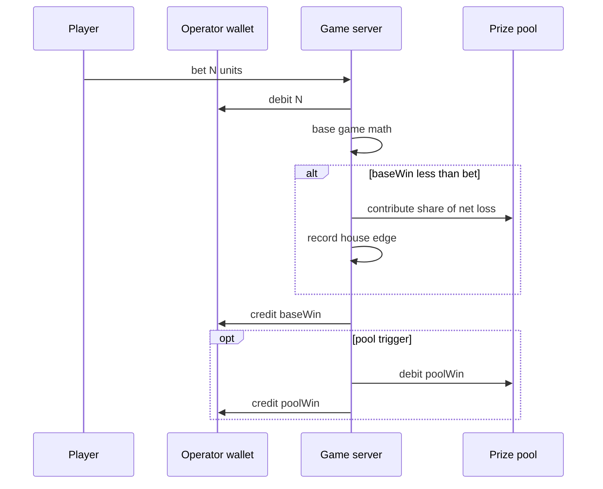

# Economy and prize pool

How the game server handles **units**, **house edge**, and **prize pools** so play stays fun in host apps (e.g. voice chat) without giving away unlimited currency.

## Design goal

Not “everyone always loses.” Not “everyone always wins.”

- **Some players lose** on a session; **some win** — variance is intentional.
- Net losses from losing sessions feed a **prize pool** (jackpot ledger).
- **House edge** — a small % of handle or net loss stays with the operator/platform.
- **Pool-funded wins** — occasional bonus payouts from the pool so winners feel rewarded.
- Over many rounds, the **player population** stays roughly neutral (e.g. −3% to +1%), while **individuals** swing up or down.

The server never knows if units are coins, diamonds, or dollars. The host app owns wallet and redemption.

## Flow per round



## Operator economy config

In [`server/config/operators.json`](../server/config/operators.json), each operator may define:

```json
"economy": {
  "houseEdgePercent": 3,
  "poolContributionPercent": 35,
  "poolWinTriggerChance": 0.06,
  "maxPoolWinMultiplier": 25,
  "slotMathProfile": "voice_social",
  "lotteryHouseEdgePercent": 5
}
```

| Field | Meaning |
|-------|---------|
| `houseEdgePercent` | % of each **bet** skimmed to house ledger (operator/platform) |
| `poolContributionPercent` | % of **net loss** on a round (bet − baseWin) added to prize pool |
| `poolWinTriggerChance` | Probability to attempt a pool-funded bonus when base win is low |
| `maxPoolWinMultiplier` | Cap on pool bonus as multiple of current bet |
| `slotMathProfile` | Slot RTP profile: `social`, `voice_social`, `generous`, `stingy` |
| `lotteryHouseEdgePercent` | Reserved for lottery-specific edge tuning (currently uses `houseEdgePercent` via `recordRound`) |

Defaults apply when `economy` is omitted (see `server/economy/operator-economy.mjs`).

## Betting config

In the same `operators.json` entry:

```json
"betting": {
  "chipUnits": [200, 1000, 5000, 10000, 50000, 100000],
  "defaultChip": 200,
  "minBalanceToPlay": 200
}
```

| Field | Meaning |
|-------|---------|
| `chipUnits` | Allowed bet amounts — slot spins and lottery bets must match exactly |
| `defaultChip` | Initial bet when session starts |
| `minBalanceToPlay` | Minimum balance hint for clients |

Implementation: [`server/betting/bet-config.mjs`](../server/betting/bet-config.mjs).

## Prize pool ledger

Stored per `(operatorId, gameSlug)` in `data/pools/{operatorId}_{gameSlug}.json`:

| Field | Meaning |
|-------|---------|
| `poolBalance` | Units available for pool-funded wins |
| `houseTaken` | Cumulative house edge collected |
| `totalBet` | Total wagered units |
| `totalPaid` | Total paid (base + pool wins) |
| `poolPaid` | Total paid from pool only |

### recordRound

After each round:

1. Add `bet` to `totalBet`
2. Add `baseWin` to `totalPaid`
3. Compute `netLoss = max(0, bet - baseWin)`
4. `houseTaken += bet * houseEdgePercent / 100`
5. `poolBalance += netLoss * poolContributionPercent / 100`

### tryPoolWin

When base win is below bet (or zero), roll `poolWinTriggerChance`. If pool has funds:

- `poolWin = min(poolBalance, bet * random(1..maxPoolWinMultiplier))`
- Debit `poolBalance`, add to `poolPaid` and return amount to credit via wallet

Slot responses may include `{ type: 'pool_win', amount }` in `events[]`.

## Slot math profiles

Defined in [`server/math-profile.mjs`](../server/math-profile.mjs):

| Profile | Use case |
|---------|----------|
| `voice_social` | Voice chat default — frequent small hits, ~92–96% base RTP before pool bonuses |
| `social` | General social casino |
| `generous` | Promotional / demo |
| `stingy` | Stress testing only |

Per-operator `slotMathProfile` overrides global `MATH_PROFILE` env for that operator’s spins.

## Lottery

Greedy and Pets use fixed symbol **odds** and weighted draws. Built-in math already favours the house vs fair odds.

Pool integration on **settlement** (when player wins on a period):

- `recordRound(bet, baseWin)` for aggregated bets vs payout
- Optional `tryPoolWin` on winning settlements for extra pool bonus

## Example: voice chat bet 5000 units

1. Host debits 5000 via wallet API before/at spin.
2. Server runs slot math → baseWin = 0.
3. House edge 3% → 150 units to `houseTaken`.
4. Net loss 5000 → 35% → 1750 units to `poolBalance`.
5. Pool trigger hits → poolWin = 12000 from pool → credited to player.
6. Player net: −5000 + 0 + 12000 = +7000 on that round (lucky); another player may net −5000.

Population over time: house edge + unreleased pool balance ≈ operator’s allowed take.

## Anti-patterns

| Avoid | Why |
|-------|-----|
| Base RTP &gt; 100% without pool | Gives away host currency |
| Base RTP &lt; 85% with no pool wins | Feels predatory; users quit |
| Server storing “real money” value | Host app responsibility |
| Single global economy for all operators | Partners need separate tuning |

## API: pool visibility

```
GET /api/v1/economy?token=OP_TOKEN&game=rise-of-olympus
GET /api/v1/betting?token=OP_TOKEN
```

Returns configured economy + betting chip tiers + current pool stats (for operator dashboards, not end-user UI by default). All amounts are raw integers — no currency formatting.

## Future (documented only)

- Per-player session RTP smoothing
- Cross-game mega pool
- Simulation CLI for tuning `economy` before production
- Client celebration for `pool_win` events
