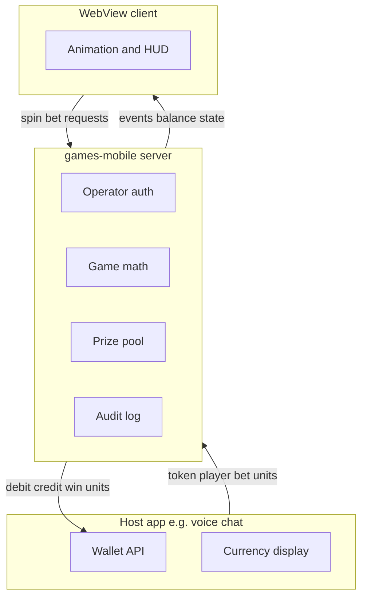

# Game server vision

This document describes the **authoritative game server** in `server/` — not the WebView UI layer.

## Responsibility split

| Owner | Responsibility |
|-------|----------------|
| **Host app (operator)** | Player accounts, wallet balance, currency name/icon, debit/credit API, redemption/cash-out if any |
| **Game server** | Outcome math, win amounts in units, free-spin state, lottery periods, prize pool ledger, house edge accounting |
| **WebView client** | Visual replay of `events[]`, input, local UX only |

## Currency-agnostic units

All amounts are **integers in abstract units**.

- A bet of `5000` is five thousand units — the server never interprets whether that is coins, diamonds, or dollars.
- The host app converts units for display and real-world value.
- **No currency symbols** in server responses or audit logs.

### Standard chip tiers

Default allowed bet amounts (configurable per operator in `operators.json` → `betting.chipUnits`):

| Chip | Units |
|------|-------|
| Min | 200 |
| | 1,000 |
| | 5,000 |
| | 10,000 |
| | 50,000 |
| Max | 100,000 |

Resolved by [`server/betting/bet-config.mjs`](../server/betting/bet-config.mjs). Slot and lottery games share the same whitelist for a given operator.

Default demo balance: **10,000,000** units (`DEFAULT_BALANCE` env).

## Unified betting

| Field | Source |
|-------|--------|
| `betting.chipUnits` | Allowed bet amounts (integers only) |
| `betting.defaultChip` | Starting bet (200) |
| `betting.minBalanceToPlay` | Minimum balance hint (200) |
| `betting.unitType` | Always `"integer"` |
| `betting.displayHint` | `"host_formats_units"` — clients/host format display |

Slot responses also include `betLevels` (alias of `chipUnits`) for backward compatibility.

Lottery `POST /bigo/v1/bet` rejects amounts not in `chipUnits`.

Optional host label: `wallet.unitLabel` in operator config (e.g. `"gems"`) — display only, returned by `GET /api/v1/betting`.

## Game types

| Type | Slugs | API |
|------|-------|-----|
| **Slot** | `rise-of-olympus` | `GET /api/v2/session`, `POST /api/v2/spin` |
| **Lottery wheel** | `greedy`, `pets-beasts` | `GET /api/lottery/:id/init`, `POST /bigo/v1/bet`, `/bet_state`, … |

Math lives under `server/games/`:

- `rise-of-olympus/` — cluster/cascade slot, free spins
- `lottery/engine.mjs` — shared period engine for wheel games
- `greedy/config.mjs`, `pets-beasts/config.mjs` — symbols and odds

## Operator model

Each integration (e.g. one voice chat product) is an **operator**:

- Identified by API **token** (`op_demo_all`, `op_voice_chat`, …)
- Config in [`server/config/operators.json`](../server/config/operators.json):
  - `enabledGames` — which titles this app may load
  - `wallet` — mock (dev) or HTTP adapter to host wallet
  - `betting` — chip tiers, default bet, min balance (see below)
  - `economy` — house edge, prize pool, slot math profile (see [ECONOMY-AND-PRIZE-POOL.md](ECONOMY-AND-PRIZE-POOL.md))

Separate operators = separate economy tuning. Voice chat and a future partner app do not share pool config unless you explicitly design that.

## APIs (operator-facing)

| Method | Path | Purpose |
|--------|------|---------|
| GET | `/api/v1/games?token=` | Catalog of enabled games |
| GET | `/api/v1/betting?token=` | Chip tiers and unit metadata for integrators |
| GET | `/api/v1/economy?token=&game=` | Pool stats, economy + betting config (admin/debug) |
| GET | `/api/v2/session?game=&token=&player=` | Slot session + balance + `betting` |
| POST | `/api/v2/spin?game=&token=&player=` | Slot round (returns `events[]`) |
| GET | `/api/lottery/:id/init?token=&player=` | Lottery bootstrap + `betting` |
| POST | `/bigo/v1/bet`, `/bet_state`, … | Lottery rounds |

Every request includes `token` (operator) and `player` (player id in host app).

## Session and idempotency

- **Player session key**: `{operatorId}:{playerId}` (file-backed under `data/sessions/`)
- **Spin idempotency**: client sends `spinId`; replays return cached response
- **Lottery session**: `X-Lottery-Session` header for in-round state

## Audit

Append-only JSONL under `data/audit/` — spins, wallet debits/credits, pool movements.

## Out of scope (v1)

- Cash-out / KYC / real-money compliance (host app)
- Cross-operator shared jackpots
- Per-player dynamic RTP targeting

See [ECONOMY-AND-PRIZE-POOL.md](ECONOMY-AND-PRIZE-POOL.md) for how wins and pools are designed to keep play fun without draining wallets.
